<div align="center">

# É C L O S I O N

**La naissance d'un monde - une expérience web 3D où le défilement est le temps.**

*The birth of a world - a 3D web experience where scrolling is time. Fully bilingual (FR/EN).*

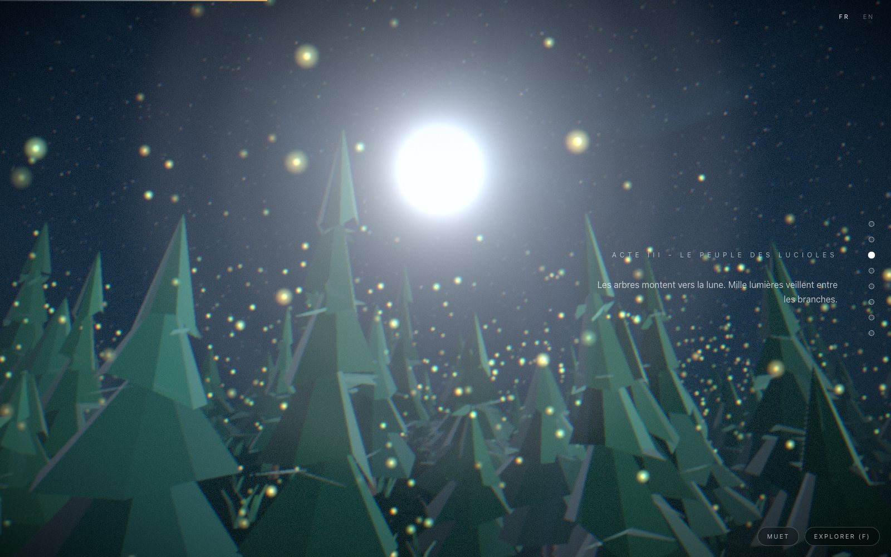

</div>

Du néant à l'aube : une graine germe, une forêt s'éveille sous les lucioles, l'orage éclate,
la caméra plonge dans un océan bioluminescent où passe une baleine, émerge au pied d'un
volcan - et la cendre devient jardin sous le premier lever de soleil du monde.

**100 % procédural** : aucun modèle, aucune texture, aucun fichier audio. Géométrie,
matériaux (bruit/FBM en GLSL), 100 000+ particules et musique (synthèse WebAudio pure) sont
générés par le code. Seule exception assumée : la typographie **Fraunces** (OFL, committée
dans le repo - aucune requête externe au runtime).

## Le voyage

| | |
|:---:|:---:|
| 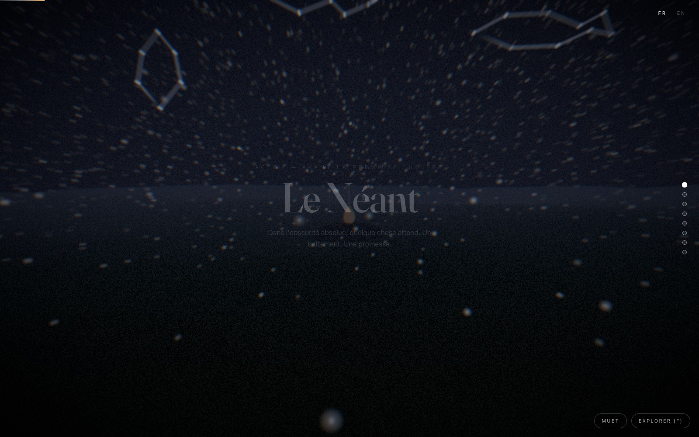 **I - Le Néant.** La promesse du monde s'écrit dans les étoiles : la Graine, la Baleine, l'Oiseau se dessinent trait par trait. | 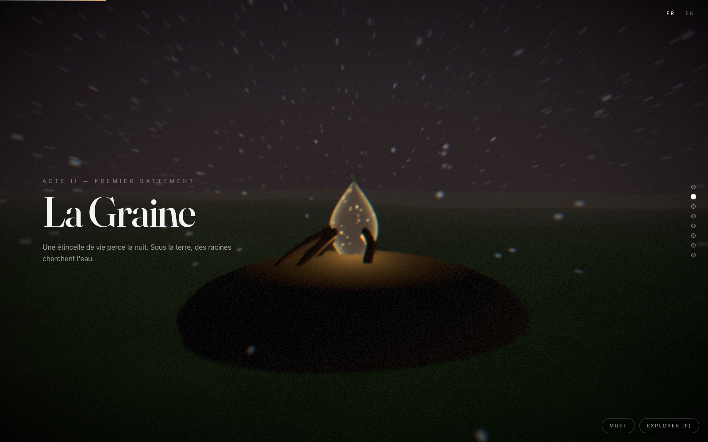 **II - La Graine.** Une étincelle de vie perce la nuit : des veines de lumière rampent hors du cairn au rythme de son battement, des braises dérivent dans l'air. |
| 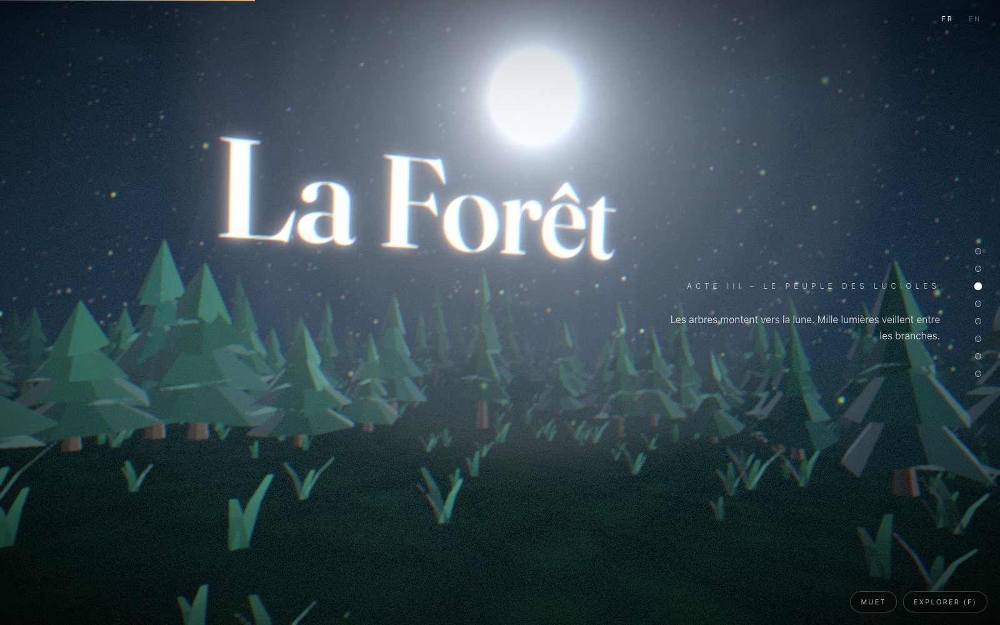 **III - La Forêt.** Sapins facettés aux jupes déchirées, courtines de lune entre les troncs, mille lucioles. Les titres vivent DANS le monde : parallaxe, brume, profondeur de champ. | 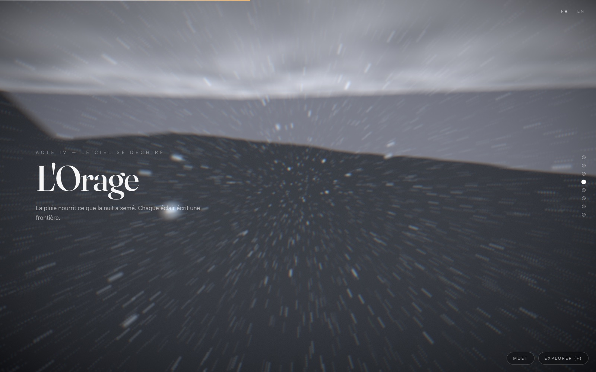 **IV - L'Orage.** Pluie GPU, nuages raymarchés, gouttes qui ruissellent sur l'objectif, éclairs à double impact et tonnerre qui claque selon la distance. |
| 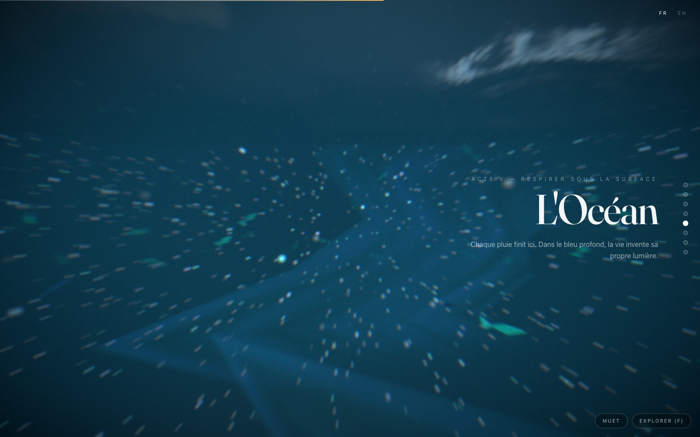 **V - La Plongée.** La surface percée dans une ondulation plein écran ; l'ouïe s'enfonce derrière un filtre passe-bas ; neuf fûts de lumière respirent vers un soleil noyé. | 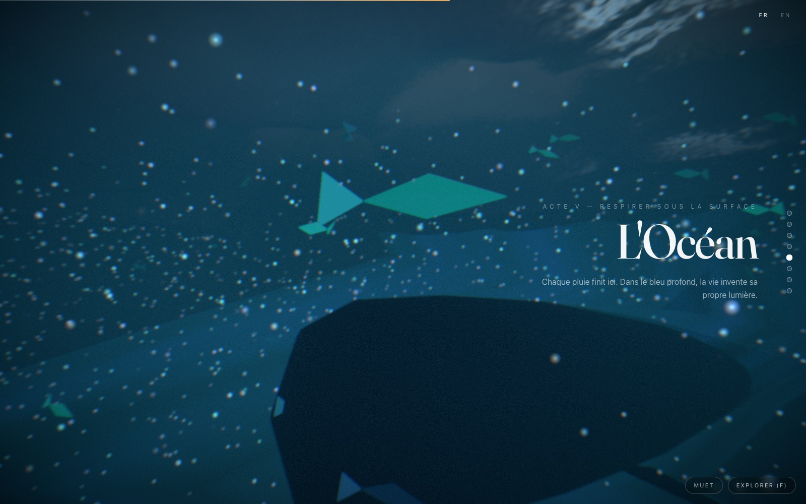 **V - La Baleine.** Une seule traversée par plongée : son dos passe sous les bancs de poissons, son chant spatialisé arrive de là où elle nage. |
| 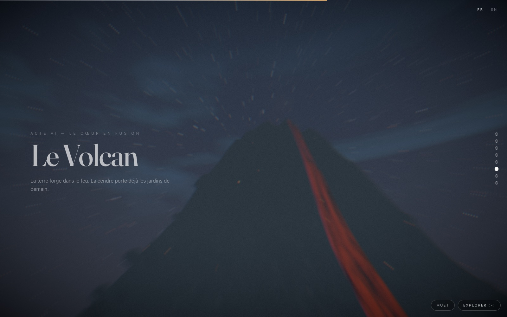 **VI - Le Volcan.** Le survol du cratère : le regard plonge dans le lac en fusion pendant que la fontaine de braises monte vers l'objectif. | 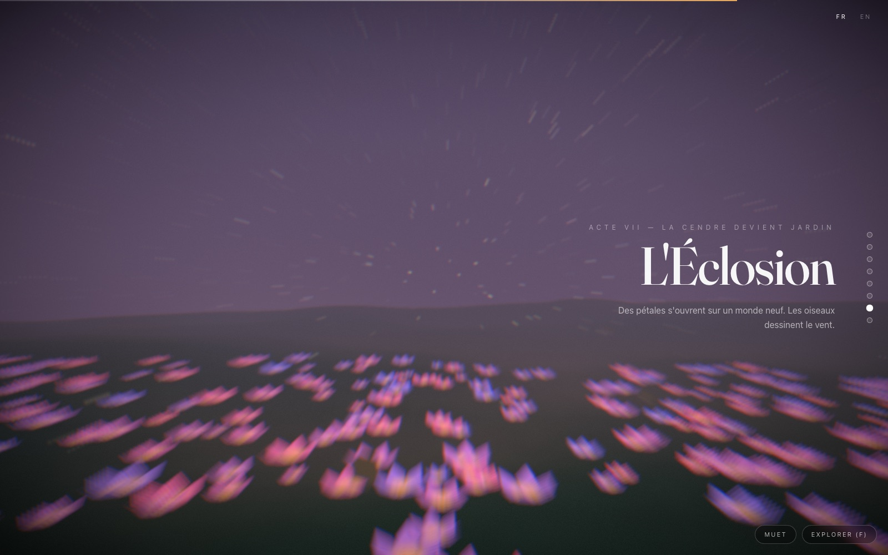 **VII - L'Éclosion.** Corolles instanciées qui s'ouvrent au scroll, oiseaux en boids, capsules physiques qui rebondissent. |
| 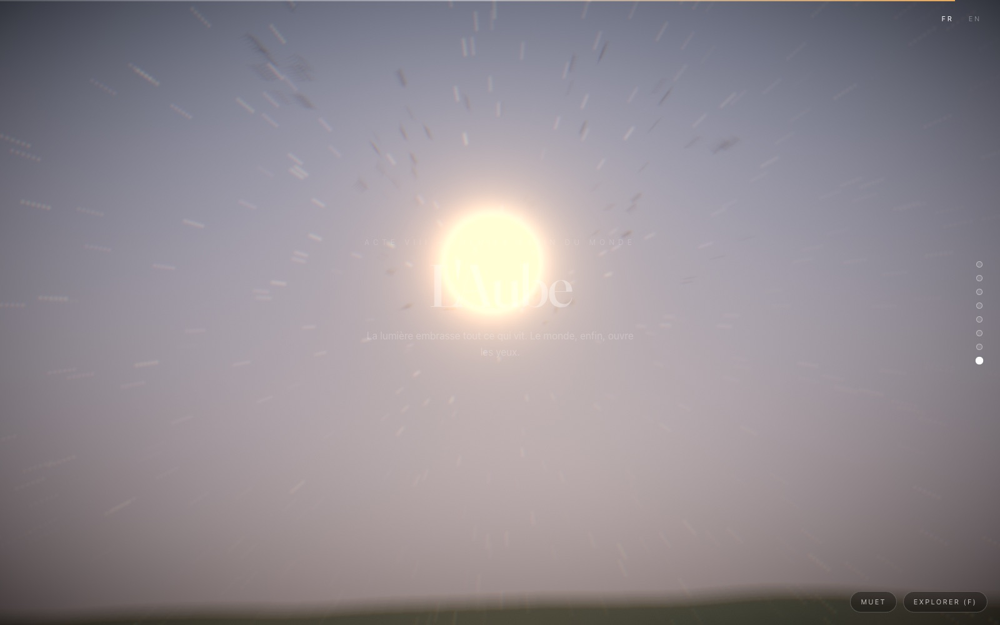 **VIII - L'Aube.** Les oiseaux traversent le premier lever de soleil, les pétales du Souffle montent vers la lumière, l'accord se résout en cloches. | 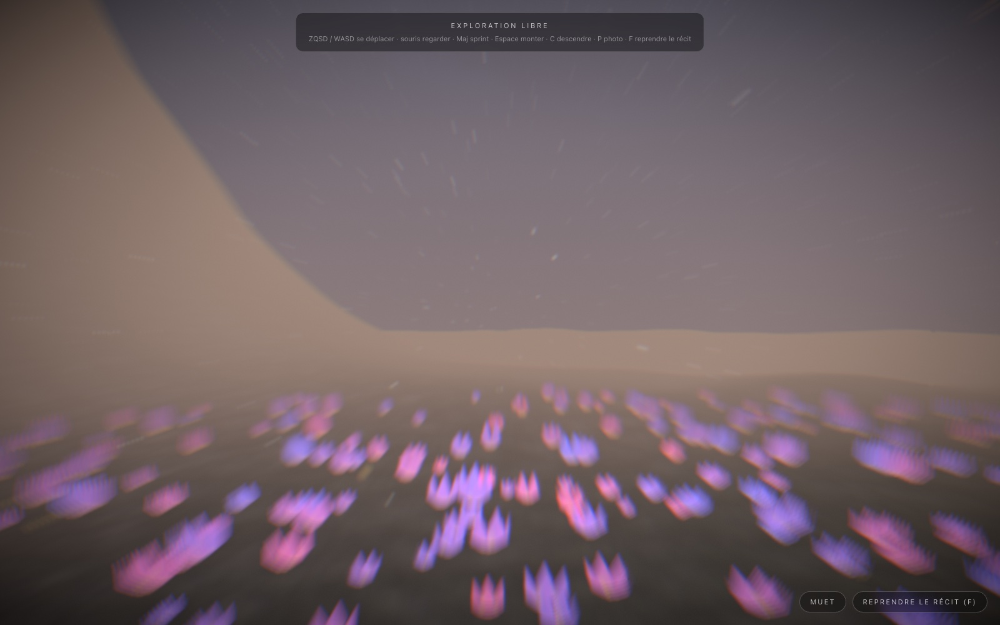 **Et après.** En exploration libre, le temps recommence : un jour complet en cinq minutes, ici l'aube dorée inondant la prairie. |

<div align="center">
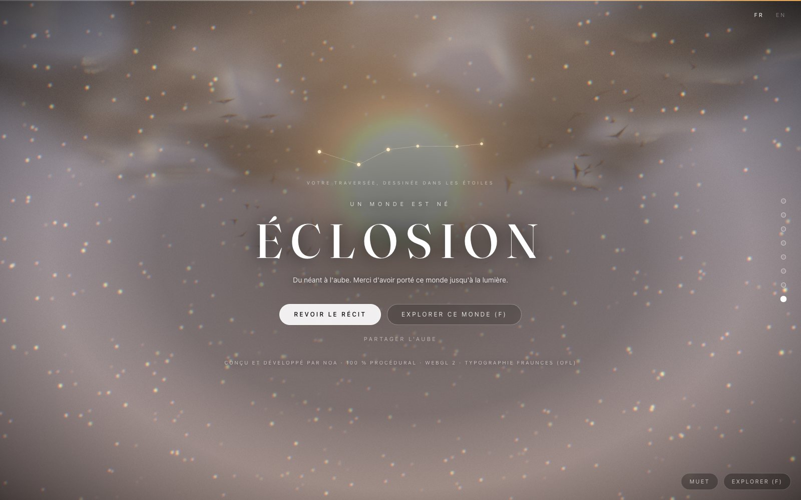

*Le titre prend son sens à la toute fin, sous VOTRE constellation : chaque étoile est un moment où vous vous êtes attardé, reliées dans l'ordre de votre voyage. Elle signe aussi chaque carte postale (touche P).*

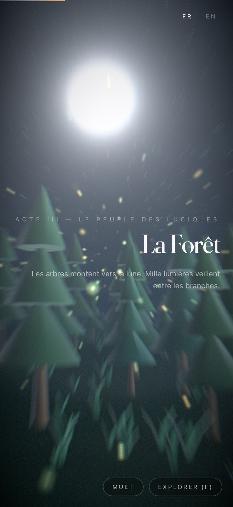

*Entièrement responsive - le doigt sème les lucioles au fil du scroll tactile.*
</div>

## Ce que le monde garde de vous

- **Votre constellation** : le film échantillonne où votre temps s'écoule ; la carte de fin la dessine, la carte postale la signe. Deux visiteurs ne partagent jamais la même image.
- **Les rencontres** : une chouette au-dessus des sapins, un poisson hors de la houle, un lièvre dans la prairie. 60 % de chance chacune, par traversée. Parfois on les manque : c'est le principe.
- **Le secret** : restez immobile vingt secondes sur l'écran final.
- **La bande-annonce** : le film se déroule seul, au rythme réalisé (ralenti sur les éclairs, la plongée, le survol du cratère). Une minute d'immobilité sur l'accueil et il se lance de lui-même, muet, en boucle.
- **Le temps recommence** : en exploration libre, un jour complet passe en cinq minutes : aube dorée, midi, crépuscule, nuit, sur n'importe quel point du monde.
- **L'orage vous touche** : les gouttes frappent l'objectif et y ruissellent ; le tonnerre claque selon la distance de l'éclair.

## Démarrer

```bash
pnpm install
pnpm dev        # http://localhost:3000
pnpm build      # build de production
pnpm lint       # eslint (no-explicit-any en erreur)
pnpm typecheck  # tsc strict
```

## Contrôles

| Entrée | Action |
|---|---|
| Molette / tactile / flèches / espace | Avancer dans le récit (le scroll est la timeline) |
| Points (rail à droite ; bande en haut sur mobile) | Aller directement à un acte |
| `F` | Basculer exploration libre ↔ récit (retour exact à la progression) |
| ZQSD / WASD + souris ; joystick + glisser au tactile (exploration) | Se déplacer / regarder - `Maj` sprint, `Espace` monter, `C` descendre |
| `P` (bouton dédié sur mobile) | Carte postale : la capture montée, signée de votre constellation ; partage natif au tactile |
| `M` | Couper / activer le son |
| `` ` `` | Éditeur de scène temps réel (leva) |
| FR / EN (en haut à droite) | Basculer la langue du récit |

## Stack

Next.js 15 (App Router) · React 19 · TypeScript strict · Three.js + React Three Fiber 9 + drei ·
GSAP 3 + ScrollTrigger · Lenis · zustand 5 · motion · @react-three/postprocessing · leva ·
Tailwind CSS 4 · WebAudio (synthèse pure).

## Architecture & choix techniques

### Le contrat de scroll (le cœur du système)

```
wheel/touch → Lenis (lerp 0.08 - le SEUL lissage) → scrollTop
  → gsap.ticker pilote lenis.raf ; lenis "scroll" → ScrollTrigger.update()
  → un ScrollTrigger maître (scrub: true) scrub la timeline GSAP (durée 1 = progress)
      ├─ les tweens mutent uniformProxies (objets plains) + uniforms des matériaux
      └─ onUpdate → écriture transiente dans progressStore
  → R3F lit getState()/uniformProxies dans useFrame  → zéro render React à 60 fps
  → le texte DOM lit UN MotionValue miroir           → styles hors React
  → React ne re-render QUE sur changement d'acte (mount/unmount de scène + aria)
```

Règles issues de ce contrat : jamais de `scrub` numérique avec Lenis (double lissage), jamais
de pinning (canvas fixe + spacer `9 × 100dvh`), timeline maîtresse linéaire (eases uniquement
sur les tweens feuilles), **toujours une `duration` explicite sur les tweens** (la valeur par
défaut de GSAP vaut la moitié du film).

### Décisions structurantes

- **WebGL2 + GLSL, pas WebGPURenderer** : l'exigence de shaders custom est incompatible avec
  TSL/WGSL. Les particules sont *stateless* : chaque comportement (pluie, lucioles en
  curl-noise, braises, vortex du final…) est une fonction fermée de `(seed, uTime)` évaluée en
  vertex shader - pas de ping-pong FBO. Buffers alloués au tier max ; changer de qualité ne
  fait que déplacer `setDrawRange`.
- **Un seul sol analytique** : `groundHeight(x, z)` génère l'unique mesh de terrain, contraint
  la marche en exploration libre, fait rebondir les props physiques et borne les boids - ce
  qu'on voit est exactement ce qu'on touche.
- **Caméra continue** : chemin CatmullRom paramétré par acte, chaque acte voyageant jusqu'au
  premier point du suivant (continuité C0 aux frontières) + amortissement spatial léger (λ=9)
  + rack focus piloté par la timeline (gros plan graine → vista de l'aube).
- **Free-roam sans resynchronisation** : entrer en exploration fige Lenis, donc la progression
  p0 reste exacte. La météo passe `timeline → simulation` (chaîne de Markov + cycle jour/nuit)
  en écrivant *les mêmes* uniformProxies. Le retour tween la caméra pendant que les proxies
  crossfadent vers le snapshot gelé.
- **Audio 100 % synthétisé** : bruit filtré (vent/pluie/océan/grondement), pads désaccordés
  (un accord par acte), oiseaux en FM, tonnerre, cloches du final, chant de baleine (sinus
  glissants + écho aquatique), souffle lié à la vélocité de scroll. 8 bus en crossfade
  equal-power ; spatialisation HRTF ; **l'ouïe plonge** derrière un passe-bas 18 kHz → 420 Hz
  pendant la traversée sous-marine. Chaîne compresseur doux → limiteur.
- **Qualité adaptative sans réseau** : tiering GPU par heuristique locale, puis un
  `PerformanceMonitor` qui descend DPR → tier avec un plancher. Post par tier (Bloom HalfFloat,
  DOF, GodRays lune/soleil, grain, speed-blur radial, grade timeline, ondulation de plongée).
- **IA comportementale** : boids CPU (grille de hachage) rendus en InstancedMesh - poissons,
  oiseaux, et une baleine qui ne passe qu'une fois par approche ; physique légère maison
  (Euler semi-implicite + collision heightfield + sommeil).

### Accessibilité & dégradation

- Sans WebGL 2 → `/fallback` : le récit complet en HTML/SVG pur (composant serveur, fonctionne
  sans JavaScript), bilingue (`?lang=en`).
- `prefers-reduced-motion` → scroll natif, particules ~4 %, ni shake ni parallax, son coupé
  par défaut, pas de pulsation du titre.
- Annonces `aria-live` par acte, parcours clavier complet, anneaux `focus-visible`.

## Arborescence

```
src/
  app/            pages (+ /fallback accessible bilingue) · polices OFL committées
  components/
    canvas/       Canvas, SceneManager (actes lazy + hystérésis), CameraRig, free-roam,
                  qualité adaptative, warm-up shaders, sillage curseur/tactile
    3d/scenes/    void · seed · forest · storm · ocean · volcano · bloom · dawn
    3d/materials/ factories ShaderMaterial (eau Gerstner, lave, terrain, ciel, fumée…)
    3d/shaders/   chunks GLSL (simplex/FBM, curl, gerstner) + shaders + particules
    dom/          overlay narratif, HUD, écran d'entrée, écran final, curseur, toggle FR/EN
    editor/       leva + persistance localStorage
  timelines/      timeline maîtresse + 8 builders d'acte + chemin caméra + uniformProxies
  audio/          moteur WebAudio, bus, synthèse, spatialisation, scheduler
  lib/            particules GPU, boids, physique, météo/jour-nuit, machine de mode, photo
  stores/         progress (transient) · app · quality · weather · lang (zustand 5)
  config/         actes, i18n, palettes, monde, particules, audio, qualité
  utils/          math, PRNG seedé, bruit CPU, sol analytique, générateurs de géométrie
```

---

<div align="center">

*Conçu et développé par Noa · Typographie : Fraunces (OFL)*

</div>
